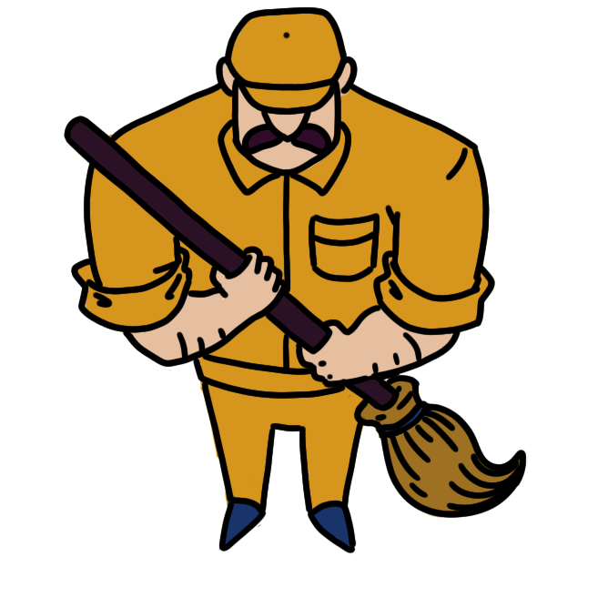
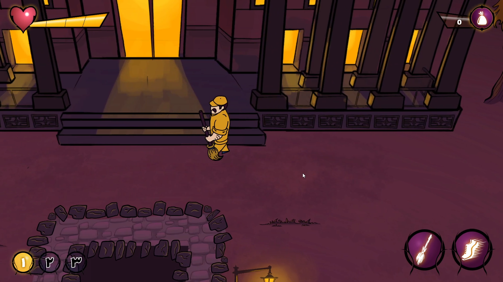
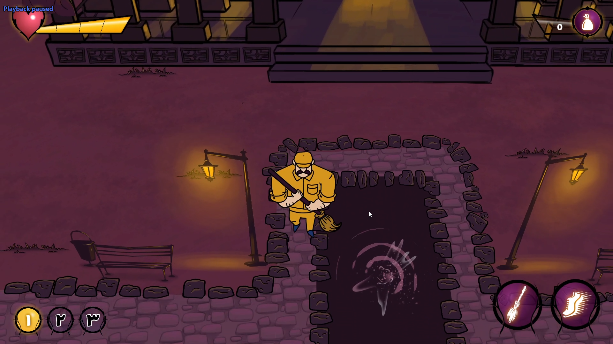
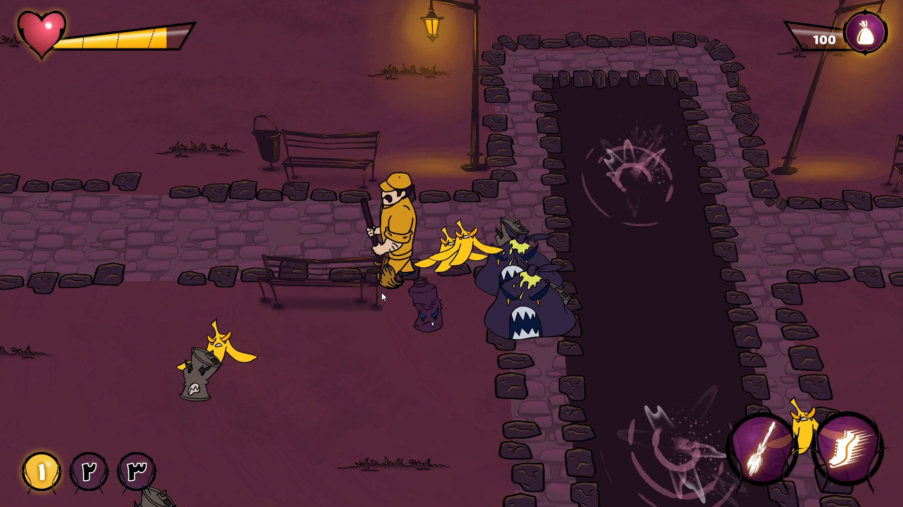

# Super Sweeper

This is 2D top down game I made with my friends in a 2 day Game jam. the jam's theme was how to make our city a better place

Play it [here](https://alithegreat74.itch.io/super-sweeper)!
## Gameplay

This game was made just to be fun. so we tried to make the hack and slash combat as fun and jucy is we could

